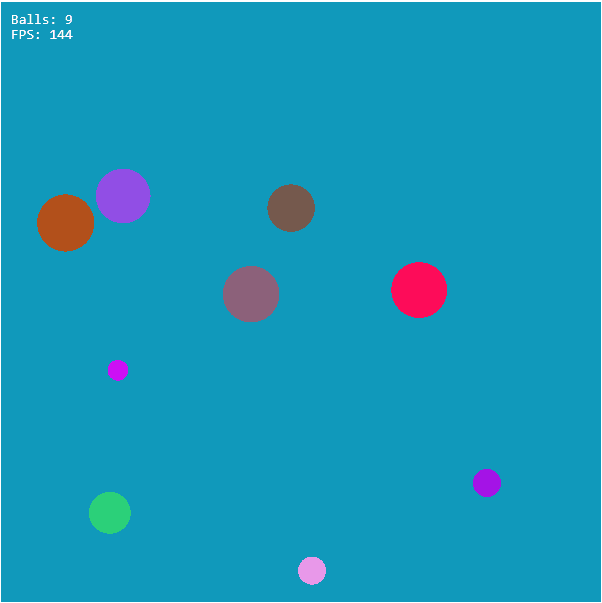

# Bouncing Balls - Pixi.js + TypeScript Demo

An interactive physics toy built with [PixiJS v8](https://pixijs.com/) and TypeScript.

Click anywhere to spawn bouncing balls with random speed, direction, and color.  
Circles bounce off each other and the canvas edges, using simple elastic collision and spatial partitioning.



---

## Live Demo

[View it on GitHub Pages](https://harrybridgen.github.io/BouncingBalls-Pixi-Demo/)

---

## Tech Stack

- **Pixi.js v8** - WebGL renderer for graphics
- **TypeScript** - Typed, modular structure
- **Vite** - Fast dev/build tooling
- **Spatial Grid** - Optimized collision detection
- **GitHub Pages** - Static deployment

---

## Setup & Run

```bash
# Install dependencies
npm install

# Start dev server
npm run dev

# Build for production
npm run build

# Deploy to GitHub Pages
npm run deploy
