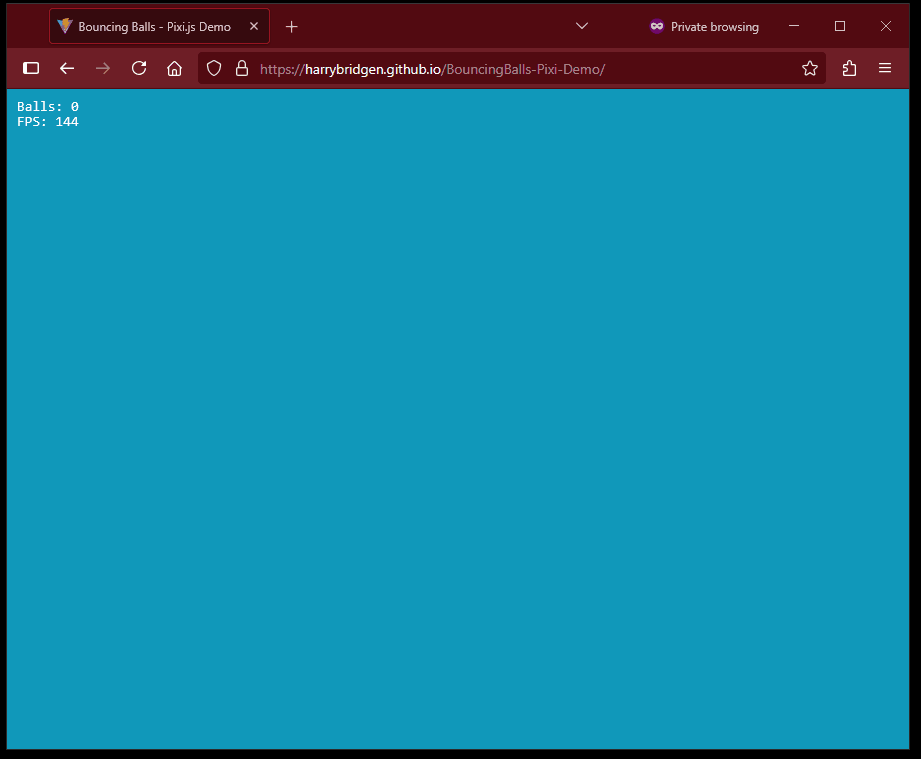

# Bouncing Balls - Pixi.js + TypeScript Demo

An interactive physics toy built with [PixiJS v8](https://pixijs.com/) and TypeScript.

---

## Features

- Click to spawn balls
- Real-time FPS & ball count
- Elastic collisions
- Lightweight & fast
- Spatial Partitioning

---

## Live Demo

[Play it on GitHub Pages](https://harrybridgen.github.io/BouncingBalls-Pixi-Demo/)



---

## Tech Stack

- **Pixi.js v8** - WebGL renderer for graphics
- **TypeScript** - Typed, modular structure
- **Vite** - Fast dev/build tooling
- **Spatial Grid** - Optimized collision detection
- **GitHub Pages** - Static deployment

---

## Setup & Run

```bash
# Install dependencies
npm install

# Start dev server
npm run dev

# Build for production
npm run build

# Deploy to GitHub Pages
npm run deploy
